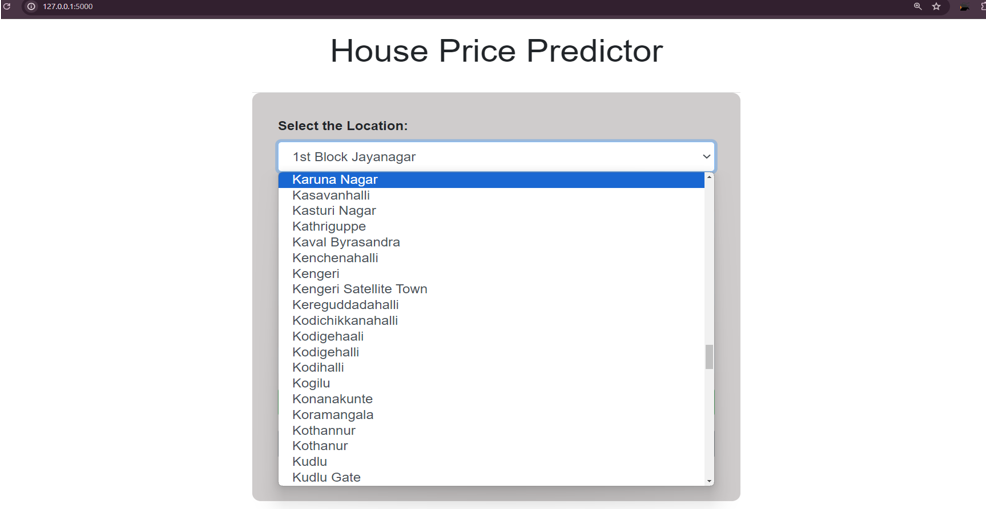
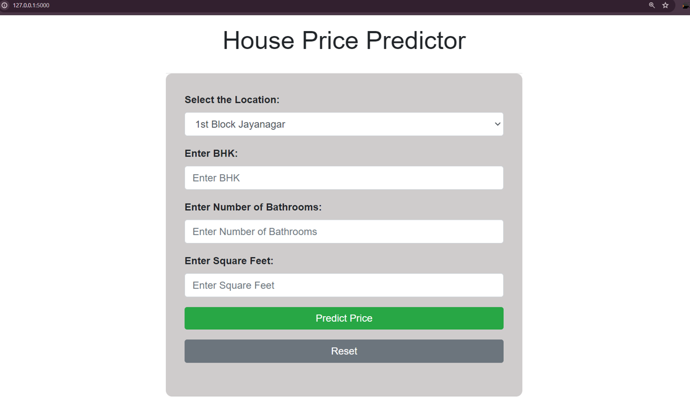
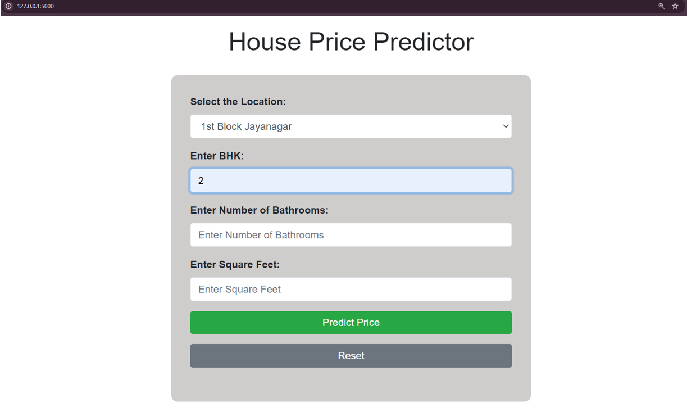

# House Price Prediction ML Model

This repository contains a Machine Learning model for predicting house prices in Bengaluru, India. The project includes data cleaning, model training, and a web application to input property details and get predicted prices.

---

## Dataset

The dataset used is:

- `Bengaluru_House_Data[1].csv`

Data cleaning and preprocessing were performed using **NumPy** and **Pandas** to handle missing values and format the dataset for machine learning.

---

## Features

The model uses the following input features:

- **Location** of the property
- **Number of bedrooms (BHK)**
- **Number of bathrooms**
- **Square footage**

---

## Model Training

Two models were trained:

1. **Linear Regression Model** saved as `LinearModel.pkl`
2. **Ridge Regression Model** saved as `RidgeModel02.pkl`

---

## How to Run

Clone the repository:

git clone <repository-url>
cd <repository-folder>

Install required packages:

pip install -r requirements.txt

Run the web application:

python app.py

Open your browser and access:

http://127.0.0.1:5000

---

## Libraries Used

pandas

numpy

scikit-learn

pickle

flask (for web app)

---

## Screenshot 

